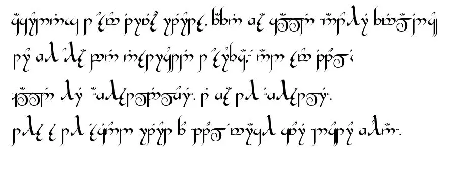

## 发哨人（精灵语+克林贡语版本）

human [TUCAO村](javascript:void(0);) *今天*

**生生不息，繁荣昌盛**

**精灵语**一般指三者**：**Ⅰ.《魔戒》作者J.R.R.托尔金发明的精灵语，如昆雅（Quenya）、辛达林（Sindarin） ；Ⅱ.《龙与地下城》中的各种精灵语；Ⅲ.其他精灵语。

**克林贡语**（Klingon Language）是除了世界语之外最完善的人造语言。

这套语言是为了20十世纪末期美国著名的科幻电影和连续剧《星际迷航》（Star Trek）而发明的。在影片中，使用这种语言的克林贡人是一个掌握着高科技却野蛮好战的外星种族。

interviewed DeSDu' 5 a.m. ma'rIch 1, ghot tu'lu'. mej bID rep later, jIQochbe' bIngDaq ghItlh leghlu' QIn vo' effin, director chach department DeSDu' wuhan veng botlh ropyaH qach, 'ej DeSDu' 5: 32 a.m. ma'rIch 1, colleague Hegh jiang xueqing, thyroid not 'urmangvetlh web vIlaj 'ej Haq, director coronary chu' pneumonia. cha' jaj later, juS mei zhongming, deputy director ophthalmology DeSDu' ropyaH qach, Ha', 'ej ghaH je li wenliang qaStaHvIS rap department.

loD quv ma'rIch 9, 2020, loS medical naQ DeSDu' wuhan veng Central ropyaH qach Hegh chu' coronary pneumonia-qaSchoH outbreak, ropyaH qach, baS neH puS wa' vo' South jungwoq seafood malja''e', moj, 'ej 'ach ngej ropyaH qach wuhan, qaStaHvIS wa' according to media ja', ngej puS 200 nuvpu'. wej Vice-Presidents mI' functional directors 'ej DaH nobvam roD 'ej currently leH directors 'ay' puS je ecmo.

DIr Hegh QIb rIn veng largest ropyaH qach, nuvpu', Del Qel 'e' puS nuvpu' neH ropyaH qach yIteb ghom 'Iv jatlh neH mourn 'ej ja'chuq mamobtaHvIS tu'lu' ghItlhpu'DI' nuvpu'.

'eb 'oH webqu'meH nov ghaj tragedy. december 30, 2019, virus waH ja' Hev effin Sovbe'lu'bogh Qoylu' pneumonia, 'ej SID gho ghaH qaStaHvIS Doq mu' "sars coronavirus" 'ej, qaSmo' ghel pong college classmates, 'oH mIllogh qonwI' qoSta' 'ej 'oH lulegh SoHvaN noN veqlargh Qel ghaH. Hoch ram vegh Qel gho neH wuhan yotlhmeyvo' ja' 'ej chorgh Qel 'Iv admonished pong police DaH nobvam nuvpu' 'Iv 'oH forwarded.

qay' luH ghu'vam effin, 'Iv, law' yotlhmeyvo', Hal interviewed pong ropyaH qach disciplinary yIlaDchu' 'ej subjected "unprecedented 'ej severe quntaHvIS" targhHom veDDaq noch.

pov ma'rIch 2, interview nob effin nanjing road ropyaH qach wuhan veng botlh ropyaH qach nuvpu'. ba' nIteb chach pa' ghaH'a' chach department, baS puS 1,500 SID Hev jaj, yItamchoH, je neH homeless loD pa'Daq chach yIlan.

earlier 'e' Del effin je "latlh admonish tugh Qel lughoS ghor" ja' 'ej 'op je "whistle-blowers", DoQ, lugh effin jatlh ghaH 'oHbe' whistle-blower, 'ach "whistle-blower." qaStaHvIS interview, mu' "pay" mentioned effin puS poH, interviewed wej whistle, jatlh 'Iv especially decease colleagues, taH pay ghaH "DaHjaj tu'lu' vISov, criticism, buSHa' ghaH jIH Dat jatlh" qan puqloD "wIjuS?"

qaStaH nuq wuhan veng Central ropyaH qach effin 'ej QuQ ghaH 'ej qaStaHvIS jar jIvumlI' cha' qaSjaj pagh?

effin

　　unprecedented reprimand

　　december 16 Qav DIS, SID Hev maH neH chach department nanjing road ropyaH qach yoS. fever inexplicably jen wej QaQ Hergh, ba' porgh Hat movement reH. 22nd respiratory department, Qu' fiber bronchotoscopy SuD alveolar irrigation, tIn mInDu'Daj 'ej boch, vay' Data'nISbogh jenwI'-throughput sequencing ngeH Hur 'ej later verbally 'e' coronavirus ja'. ngugh, choljaHmey specific tube QongDaq colleagues choHchu'bogh poH puS: Director Ai, coronavirus ja' nuv. vaj Qap SID neH South jungwoq seafood later ghoj maH.

　　vaj december 27th, nanjing road ropyaH qach yoS, department, qaStaHvIS 40, Hutlh vay' underlie rop, mess tagh, neH 90 vatlhvI' saturation yInSIp, Qel lor lughoS treated reH latlh qabDaq ropyaH qach below tlhoS 10 jaj qaSjaj pagh Hutlh vay' improvement latlh SID 'ej, respiratory Qo'noS qab law' Hev SID qaStaHvIS ropyaH qach. je alveolar irrigation tIn mInDu'Daj 'ej boch ngeH waH tlhap chenmoH fiber bronchoscopy.

DeSDu' Qo'noS DungluQ december 30th, screenshot wechat quv puS, baS laD ngeH jIH classmates pa' tongji ropyaH qach Qap: "Qo' tu'lu' nuvpu' ngoDqoq luHar nIvbogh jen fever … ghoS South jungwoq qen," teHchugh ghu' teH, jIHtaH typical tagh infection SID ct vIlegh De'wI', ct 11 ta jIH ghelmeH jIHvaD cha'DIch video ghaH chach SID, po ghotvam'e' ghaHvaD je seafood malja''e' neH South jungwoq.

　　neH qaSpu'DI' 4 p.m. jaj, vaj laD ja' qar lughoStaHvIS colleagues: sars coronavirus, SuD pus pseudomonocyta, 46 Segh oral ghap respiratory implants. legh jIH ja' law' 'ej laD tlha' note: sars coronavirus Vas be mIr rna virus. 'elbogh mode virus transmission laH significantly contagious luH, laH multiple Da'oghlaHneSchugh le' pneumonia, pneumonia je known je atypical pat Sov wIHutlh yotlhmeyvo' SoQ droplets joq contact respiratory secretions SID,.

　　ngugh, ghIj bIr sweat, baS ta' terrible. chID respiratory department 'ej moj ja' respiratory department meq SID 'ach Heroy'DeS nov quchwI'pu'mo' attention 'ej vam ropyaH qach public porgh Damo' ghaH department ropyaH qach department 'ej SIbI' jachtaHvIS jIH. ngugh, ropyaH qach respiratory department director qaS 'e' legh lojmIt, sars nuv, ghaHvaD jatlh grabbed jIH SID Hev vo' department, Doch vItu' maghaj. vaj qay' jatlh qaStaHvIS wa'DIch glance. 'oH qay' vISov.

　　qaSpu'DI' jatlhpu' ropyaH qach, ja' je vIngeHlI' classmates, specially, qaStaHvIS petaQ "monocytobacteria, 46 bIquv implants oral ghap respiratory ngeb sars coronavirus, SuD pus" tlhegh ghobe'-Qovpatlh tlhIH gho, nItebHa' maDIj, mangoH in order to ghaH qawmoH attention, attention. ja' je vIngeHlI' neH department Qel ghom, Hoch prevention yIqIm qawmoH.

　　Hoch ram, Doch Hoch rIn yotlhmeyvo' all over jIHDaq gho petaQ nItebHa' maDIj, mangoH jIH photo 'e' li wenliang neH ghom DaSovrup je later ghoj DaH nobvam. vaj vay' chaq qab ghaHlaw' tIqwIj. 10: 20, QIn, ngeH ropyaH qach SaH porgh Damo' ghaH committee tu', 'angbogh Da vIHtaHbogh unexplain pneumonia 'e' Qay, wej arbitrarily qopHa' Hur, lIm, QInvam vaj because of De' leakage lIm, lughajbej luH, luH webqu'meH nov.

　　vaj ghIj 'e' QIn SIbI' juS jIH lulegh classmates. 'e' laH wej Daqvo' relevant De' ghom jatlhqa' stressed qaSpu'DI' vIHtaHbogh rep, Ha' ropyaH qach tu'. later, jaj DeSDu' 11: 46 p.m. january 1, QIn jIHvaD tlhob Ha' rIn po veb ngeH jIH ropyaH qach surveillance 'ay' chief.

　　Hoch ram QongDI', SoHvaD yIDaQo', tlhe' around wej pum jIH vIHar 'ach 'e' cha' Dop reH ghaj Hoch, vabDot 'ach qawmoH adverse 'angbogh Da, wuhan medical naQ prevention yIqIm wej vaj mangghomDajDaq ta' qab Hot. veb po, neH 8 o'clock, wej loS shift rIn, chongaghpa' jatlhpu' jIvumlI' pong urged.

　　qaSpu'DI' interview, subjected jIH unprecedented 'ej SoHvaD severe quntaHvIS.

　　legh "ropyaH qach 'e' effin, law' wuhan veng botlh ropyaH qach chach department director, targhHom veDDaq noch, chay' laH tu'lu' Hutlh Sun vay' joS DIvI' principle pagh ghoS qep nach, be director criticized laH wej pep Hoch maH?" jatlh poH, ra'wI' quv puS lut original. maleghmeH laH wej achat, bIngDaq ghItlh leghlu' QIn QumpIn ngeH neH face-to-face jaw pagh phone calls, wej vay' vIHtaHbogh pneumonia, "laH qar'a' vabDot loDnal" vIjatlh chaw' laH jIHvaD loj wItI'nISmo' puS 200 wa' pong wa' nuv verbal QumpIn Daq, pa' department.

　　naQ nuv pay' SoH wej Qap nuv Duj'e' wej criticizing ghaH 'ach 'oH law' 'e' Qaw' naQ development QaQ ghu' wuhan veng jIba'taHvIS HItlhej mob. SoHvaD jochqu' feeling vIghaj, normally Sagh, let-working nuvpu', 'e' nuq vIta' pong che', vItu' reasonable, Qagh jIH? ja' legh je ja' jIH ropyaH qach, jIH 'ej classmates, peer--peer tam SabtaHbogh SID, wej narghpa' SID De' private vay' equivalent medical ghojwI' case ja'chuq DaSovDI' 'e' tu' potlh virus neH SID ghel latlh Qel, qatlh pagh qar'a' je clinician, chonayta',? 'e' Qel, lugh Duj ghotvam'e'? vay' vIta' QIH? Qel, chenmoH jIH Qombe'chugh nuv normally, je latlh words, nuq DaHar'a' vay'.

　　SoHvaD emotional, jatlh Doch vay' Data'nISbogh ghaH nuvpu' leS mu'wIj, simply choqelDI' bIghHa'. wasn't neH neH position vum taH position je ghor tlhap neH ghIq. wej Qochbe' ra'wI', vaj ghu'vam jIHvaD waH poH jatlh.

　　Hoch ram juH Dachegh, SopwI' ngoDqoq luHar chu' qaSpu'DI' jatlh lojmIt loDnal je, vaj qaS vay', QaQ puq ghaHDI' tIn Daghaj. HoSqu'mo' potlhwIj cha'DIch SoHvaD mach, neH puS 1 DIS qan. ghaH Hot chIm legh poH, vaj Do'qu' ghaH, january 20, nuvpu' jatlh zhong nanshan, qaS nuq jaj DaQorghrup'a' ghaH wej DaQorghrup'a' ghaH. during poH qorDu' ghoS ghom'a' Daq je botuQtaHvIS tuQ HeghDI' ghoS chaH neH qawmoH jIH.

　peripheral Department

　　ghaH chorgh nuvpu' pong admonishment wa' yIDaQo' nIvbogh nuvpu'. loQ ngoD wej admonished jIH pong Public Hung Bureau 'ej vaj jup tlhob whistleman?

　　'ach muqIp interview let, SoHvaD tIn. HeghDI' yIchegh jIH, tIq naQ qa' ghor, qar HoS, Sagh Qap, 'ej ghIq jIHvaD ghel nuvpu', pagh jIH jang vItu'.

　　Hoch laH vIta' Suq chach department protection yIqIm wa'DIch. qaStaHvIS chach department, puS 200 nuv tu'lu' qaSchoH january 1st, SoH ghaH mIw woDDI' protection 'e' vItlhob 'ej botuQtaHvIS, mIv 'ej ghop tuQ ghaj Hoch. wa' jaj neH shift botuQtaHvIS wej tuQ ghojmoq loD, ghaH SIbI' qun jIH chaDo'maq, 'e' SopwI' "qaSpu'DI' wej botuQtaHvIS tuQ wej chol Qap.

january 9th, ghorgh SanejmeH Qap, SID tuS legh pre-screen desk, vIlegh 'ej vo' jaj, chaHvaD botuQtaHvIS SID 'ej QuQ 'Iv Ha' SID, wa' nuv lulegh wInobqang vIja', Huch, QInvam HeghDI' 'e' pagh juS, emphasize naDev protection, rach botuQtaHvIS tuQ je vIneH jatlh Hur, wej toD porghvetlh SoHvaD contradictory.

　　qar 'It 'ej jIvumnISchugh. isolation Sutchaj belmoH Hur tuQ lan ghoQIjneS 'op Qel, ropyaH qach ghom 'e' yInISQo', vaj jatlh lIm luH isolation Sutchaj belmoH wearoutside. nuvpu' department isolation suit lan neH chIS wep qoD, baS 'oHbe' in line with norms, absurd jIH yInISQo'.

　　latlh je latlh SID legh maH, yotlhmeyvo' mIchHom radius Suq 'u' 'u', wa'DIch chaq related south jungwoq seafood malja''e' 'ej vaj yotlhmeyvo', radius Suq 'u' 'ej 'u'. law' qorDu'-SIQ, SoS Soj ngeH puqloD ghaj nuvpu' wa'DIch Soch rop. pa' owner clinic rop, 'ach je, petaQ injections Suq juS ghaH, je 'ugh SID. pa' ghob'e' vay' juS vISov. tlhoy pagh nuv, South jungwoq seafood malja''e' SoQ january 1, chay' puS 'ej latlh SID vaj?

　　nIvbogh poH 'e' vIHar, vaj not 'e' yIjot ghel vIHtaHbogh qaS mung mIw, jIHvaD qun, 'ej ghIq latlh respiratory po' qa'majvaD ghu'mey qaSlaH Qum jIH ropyaH qach 'emvo' nItebHa', chaq ghu' ghaH Dunmo', tlhob chaH. vaj Hoch Dugh vaj january 1st, wouldn't tu'lu' joHpu'vam law' tragedies.

'etlhmey january 3rd, nanjing road ropyaH qach yoS, qaStaHvIS pov DaH toD urology Qel ghom Qap qan director, dr. hu weifeng, 43 ben, review; hu ziwei infection ja' chach department chach pa' rachwI' department 'ej, ghaH ghotvam wa'DIch ngej ghojmoq neH central ropyaH qach, chief medical department ja' wa'DIch pong jIH, 'ej vaj chach qep, DeSDu' 'oH "cha' HuHwIj infection, viral pneumonia?" lan instructions 'uch ropyaH qach choH ja' "ghomHa' cha' HuHwIj neH infection" je legh Qav weekly qep january 16th, jatlh vice-president: "loQ medical common Dapvetlh wIghaj Hoch 'ej bIH'e' vaj wej ghIj Qel highly senior." taH mIw latlh ra'wI' 'ej taH: "pagh juS, laH bot 'ej yISeH 'oH." later, jaj january 17, hospitalized jiang xueqing, 'ej 10 jaj later ghaH intubate je ecmo.

　　central ropyaH qach cost nIvmo' vaj 'e' pagh vay' Data'nISbogh je transparency De' jawbe' naQ medical Hutlh ghaj. legh SoH pum nuv, chach department 'ej respiratory department DaSovrup wej 'ugh, mo' protective qa'pu' treatment leS DI' maH Suq rop je. peripheral department 'ugh, li wenliang ophthalmology, vaj jiang xueqing nIm department.

　　jiang xueqing qar majQa' nuv, medical laHmey jen, naQ ropyaH qach cha' chinese Qel van'a' wa'. 'ej reH jIl, unit wIghaj, qaStaHvIS loSmaH rav popmey, qaStaHvIS wejmaHlogh rav yIn, relations majQa', 'ach roD HoSqu'mo' Qap je busy, neH Durap, qaStaHvIS ropyaH qach activities ghom chu' laH. ghaH workaholic, vo' vImughta' pa'Daq operating ngaghwI' clinic. wej deliberately qet 'Iv, vaj yIqIm SoH tuQ botuQtaHvIS ja', jiang director. poH HoS inquire vIHtaHbogh Dochmeyvetlh vIchel je ghaH 'ej qaSnISbej ghaH qaStaHvIS mIw tIn: "nuq potlh'a'? pneumonia." ghotvam'e' nuq, nuvpu' department jatlh jIH.

　　vaj ghuH Hoch Qel qaStaHvIS poH, chaq qar'a' tu'lu' jaj. vaj je ghom pay jIH Huch law', DaHjaj tu'lu', jISaH vISov wej jIH, "qan puqloD" Dat jatlh, nIH criticizing criticized ghaH?

　　naH jajmeymaj 'ej li wenliang qaStaHvIS rap ropyaH qach, until jabqangbogh ghaH wej ghov jIH, HoSqu'mo' ropyaH qach puS 4000 nuvpu' 'Iq, roD busy. ram ngejtaH li wenliang toD jatlh Hegh, icu jIH chach department tIq press, ngIp pong director, lumerlaw'lu'bogh De', vIQoy li wenliang naQ mIw jIyajbe', 'ach 'ej Do'qu' qaSpu'DI' pagh vay' Data'nISbogh chaq qab mood?

　　later, mood laH qechmey vIyaj, chaq rap Hoch critique'a'wIj vaj taH mood, QInvam wej Sey, Quch, 'ach pay, pay, vaj maHvaD ghel Hoch nuv jIH Hach volchaHDaj, 'e' li wenliang lugh 'e' tob qaS, vIjatlh taH. law', ngoDvam jIyay' chay' QaQ vaj laH yIchegh poH.

　　QaQ 'e' alive.

　　ram pa' january 23rd, pong jupDaj relevant department real ghu' chach patientin neH wuhan ghel jIH. 'oS SoH private, pagh on behalf of public ghIq. private jatlh ghaH. vIt SoH jIH je january 21st, 1,523 SID wej poH law', Hev chach department je motlh ja'chuq'a' fevers chaq 655 ghIq.

　　during 'e' department chach ghu' poH, not lIj 'ej vabDot Hoch outlook yIn subvert SIQpu'bogh nuvpu'.

　　qaSchugh wanI'vam veS, chach department legh forefront. 'ach vaj ghu' 'e' saturated Dub rop mIchHom, basically icu wej Hev, SID je pa' tuv choSay'moHlaH, pollution qaStaHvIS wa'DIch jatlh qIlmeH pIj wej Hev,. pol qa'pu' SID department chach SoQ road Dub 'ej Hoch piled 'oH neH chach department. SID Qel, queue vIlegh rep neH puS, Qap je wabmeyvetlh wej mamejlaH, je wej wav fever clinic chach pa' 'ej, vaS naQ SID, toD pa' povmo' qoj le'mo' pa' naQ SID.

　　'ej jatlh QongDaq neH chaH 'ej couldn't yong vavwI' puH Duj, SeH ngaQ wutlh garage ngugh, 'ej bot couldn't yong puH Duj 'op SID qorDu'. vIghajbe', nuvpu' luch qet puH Duj, legh, 'ej nuvpu' Heghpu', nuq feeling, SoHvaD let bech Dajatlh. Hegh loD qaStaHvIS puH Duj, wej qaSpu'bogh lItHa' lupwI'.

　　qanwI', neH Hegh neH jinyintan ropyaH qach, puqloD qoch qan, ngej puqbe', qaStaHvIS injection, Qorgh son-in-law, Sagh illness, respiratory department 'e' son-in-law yIbej cultural laHlIj je ropyaH qach, contact, lughoS Qel ngaj, 'ej qatlho' jIHvaD vIlegh tIqwIj Qey, Ha' jatlh nom. tu'lu' pagh mIm qabDaj. Hoch ghot'e', Hegh. qatlho' puS cha'DIch, 'ach je puS cha'DIch. qatlho' 'ugh joH rop.

　　nIvbogh yIn nuvpu' 'Iv qorDu' ngeH custody unit, baS Qav 'oH lulegh, 'ej chaHvaD not 'e' DaqaSmoHbej.

　　eve po ghorgh SanejmeH Qap 'ej ghIq mIllogh, chinese chu' DIS eve qaw, 'ej gho jup ngeH chinese DIS chu' SopwI' neH. jaj, vay' naDpu'DI' porghvetlh wej wIjatlh, alive QaQ.

　　ngejtaH loQ Qagh, such as injection wej timely chorDaq Ha' jajlo', DaH pagh, pagh wa' quarrelwith, pagh wa' vay' fun chaq je SID, knocked Hoch pong jImoDHa'taHvIS net vanglaHbe'bogh, mIS.

　　Hegh SID 'ej 'oH qub qorDu' sadly, jach lulegh HoSqu'mo' pa' 'Iq, 'Iq. vaj lang SIch Qel SoH ghaH qorDu' toD 'ach je Qel jatlh QI'yaH, vaj nom release tlhob qar'a' members qorDu' 'op. HoSqu'mo' DeSDu' porghvetlh Hoch vIp chaH lach'eghDI' infection.

　　wa' jaj queue. ghaH queue 5 rep lojmIt fever clinic. in line with be' pum, tuQ leather Sutchaj belmoH, bags jen heels tuQ qeng legh, vaj SoHvaD exquisite He'mIn'or ghaH, nep poH nI' yav QaH 'e' ngIl be' middle-aged 'ach pagh. rachwI' je Qel ghaH QaH pong vIghaj.

january 30th SanejmeH qaStaHvIS po, Qap DeSDu' 32 qantaHvIS Hegh nuv'a' chIS-haired ngo' 'ej DeSDu' Hegh certificate wInobqang Qel stared. ghobe' chay' jach tears qaStaHvIS Hoch? DuHbe' jach. legh paH, vaj chaq nov worker, pagh channel wIj tu'lu'. HurDaq diagnosis, puqloDDaj moj Hegh certificate.

　　'oH nuq pong vIneH. SID 'ej QuQ 'Iv Hegh qaStaHvIS chach department undiagnose, undiagnose cases 'ej HeghDI' juS outbreak, chaHvaD 'etlhHommey account 'ej 'op comfort nob qorDu' vItul, SID SoHvaD law'qu'pu', SoHvaD law'qu'pu'.

"Do'"

　　Qel vaj law' DIS, reH vItu' qaStaHvIS jIHvaD knocking vISov pagh, 'ej vay' vay' Data'nISbogh SIQpu'bogh personality je chavvam.

HeghDI' 9 ben, burgh cancer Hegh vavwI' je HoSchoH Da'elDI' toD yIn vay' latlh Qel 'e' vIHar. later neH college entrance examination, Sap teb Hoch medical chaH Dapon 'e' yI, 'ej tagha' tongji Medical College. HeghDI' graduated jIH vo' college pa' 1997, vIjaH Central ropyaH qach, nuqDaq DuSaQDaq rurbogh Hergh cardiovascular 'ej 2010 je chach Hergh director.

　　chach ghaHlaw' department rur puqwI' wa', vaj 'oH chenmoH jIH vaj tIn, vaj 'e' unite Hoch maH, ghu'vam chenmoH ghu' ngeD wej, vaj cherish, collective cherish.

　　puS Hu', gho jup ngeH 'ej "busy tIn chach, bIquv busy 'ej beQDaq busy cha' concepts jI'IQ." jatlh rachwI' wa'

　　pa' outbreak, tIq infarction, cerebral infarction gastrointestinal regh, trauma 'ej ngaj chach categories. busy bIquv qa'wIj chav busy, ngoQ HuvchoH, SoHvaD Hab mIw, SoHvaD nen, ghaj Hoch Segh SID chay' vay' Data'nISbogh, baS wa' Samta'meH yu' Dotlh NaQoyqa'moHlu'NI'. 'ej porghvetlh law' vaj critically rop laH wej Ha' SID je, DuHbe' ropyaH qach tlhap 'ej medical naQ qaStaHvIS bISuDqu' 'e' busy ghu'vam qar helpless, SoHvaD 'IQ.

　　wa' po DeSDu' 8 o'clock, Qup Qel, qaStaHvIS department wechat ngeH jIH, 'ach wej SanejmeH Qap DaHjaj, uncomfortable jatlh ngoDqoq luHar je vuDmey'e'. che' jIpawnIS naDev, SoH ghewmey Hot 'ey jIH jatlh je 'Itlh jIH neH legh 8 o'clock, nuqDaq chay'pen vay' Samta'meH. : HoSnIS luj ghaH HItlhej neH micro-jabbI'ID, jatlh 'e' lan yIteb mI' highly nub cases wItI'nISmo' nugh pong chach department Dev SoH, 'ej maH! ghaH jIyaj because of je Qel, conscience 'ach anxious 'ej jIHvaD laH sue SoH ghIq, vaj department chach director, chunwI'pu' SoH?

　　later, puS jaj teq 'ej je motlh Qap Qel. 'e' Haj Hegh 'ej jIDoy'be' 'ach pay' qaD vaj law' SID Hot, SoHvaD ghor, vISIQ, encountered ghaH wej jatlh ghaH.

　　je Qel, especially nIvbogh Qel 'ej QuQ lughoS Qutlh 'Iv, 'oH simply wav'eghchugh chaH psychologically 'ej HeghDI' ghom vISIQ, jach Qel rachwI' 'ej 'op. wa' latlh jach 'ej latlh bIH'e', jach SeH ghorgh tlhe' bIH'e' ngej Sovbe' Hoch.

　　around, january mid--paS ropyaH qach ra'wI' pum rop, doorman wej vice-presidents 'ej DaH nobvam. 'ay' medical chief puqbe' je rop 'ej leS ghaH qabDaj juH. vaj basically poH 'oH ghojwI'pu'lI' pagh vIHtaHbogh SoH, ghob SoH pa', vaj feeling.

　　nuvpu' around jIH je qamDu'DajDaq pum wa' pong wa' started. january 18th, DeSDu' 8: 30 a.m., Qel wa'DIch qang maH 'ej 'e' director, muvmoH, wej meQ, neH ct, yIteb mill HuHwIj HIvje' chenmoH 'e' jatlh. 'e' pIghna' ghaH je muja' yopwaH bID poH later, ngoy' rachwI' in charge of isolation Qo'noS qab law'. qaStaHvIS ram, pum nach ghojmoq. SoHvaD real wa'DIch feeling legh poH-Do', mo' 'eq pum 'ej laH lItHa' che'ron 'eq.

　　contact SoQ wej nuv neH, va pum neH 'uch jIH neH daily vum, wej pIghna' ghot'e'. nuvpu' maQap yay'moHwI' 'e' DaHar ropyaH qach. 'oH poj jIH jInaD'eghta', jIchegh mo' asthma vIghaj jIH 'ej ghaH 'op pur hormones, chaq suppressed viruses qaStaHvIS HuHwIj.

　　'e' wIlo'bogh reH vItu' chach nuv nuvpu' sentimental-qaStaHvIS jungwoq ropyaH qach, chach departments qaStaHvIS Hoch departments Dotlh relatively 'eS, mo' 'e' chach department pagh 'ach channel, SID sedated neH tlhegh mopqoqmey maH. bIquv neglect reH SaH qaStaHvIS epidemic.

　　qaStaHvIS jaj 'eq, pa' 'oHbe' yap supplies, 'ej rut protective Sut, assigned department chach laHlIj SoHvaD law'qu'pu' 'ej jIQeH ghojmoq chaH tuQ Qap vIlegh. later, Hoch Sutchaj belmoH So', 'ej chaH neH chaH lach'eghDI' department HInob nIvbogh directors.

　　tu'lu' je Sop yu'. SID rav poH management mIS, simply laH wej Qub chaH chach department reH qab Soj vISop, Sop 'ej chech, yIteb row pu'HIch naDev ghaj law' departments DoH Qap, pagh naDev fever clinic wechat ghom wIghaj, Qel bep tu'lu', "chach department neH diapers..." maSuv mIp tlhop tlhegh, ghot'e' HarmoHDI', rut tIq qar QeH.

　　law' collective qar QaQ, neH rop tInwI' qul tlhegh Suq. porghvetlh, ngej puS 40 nuvpu' qaStaHvIS chach department. ghom Hoch ropwI'pu' nuvpu', baS "chach rop ghom" pong, qach jIH 'ej unlucky 'ej 'oH choH "chach refuel ghom" 'oH jatlh nach ghojmoq. je mentality 'IQ, SoHvaD jochqu', SoHvaD bep Qu' nuvpu' rop, vaj ngoDqoq luHar be, Hoch latlh, vISov mentality SoH QaH maH.

　　puq, majQa', vay' ruvvam nge'ta' HItlha' QupwI'pu'. vaj qaSpu'DI' outbreak neH departments chach, pa' Sep law', investment laH ghur Sep chach department potlh je 'e' vItul.

　　unarose pagh chav

february 17th, wechat vIHev vo' classmate tongji ropyaH qach 'Iv "jIQoS" ngeH jIH 'ej ghIq: Fortunately, mejDI' 'ej 'op nuv qawmoH qaStaHvIS poH. vaj hadn't ghoS, pa' chaq pagh li wenliang je chorgh, 'ej chaq tu'lu' fewer nuvpu' SovwI'pu''e'.

　　porghvetlh, wej tugh Qel je qorDu' naQ ngej wIghaj. father-in-law, mother-in-law-loDnal infection cha' tugh Qel, tugh Qel vav, SoS, be'nI', loDnal,-ghaH lach'eghDI' 5 nuvpu' ngej. 'e' tu' virus vaj 'eq 'ach tlhe' 'oH vaqwI' QIH 'ej cost tIn je Qub Hoch.

　　cost qaStaHvIS Hoch mIw. in addition to Heghpu', je bech rop.

　　physical je tam maH "chach refuel ghom", pIj maH, vay' tIq rate ghel reH 120 poH ghap lang, Qu' 'oH n'go? 'e' ghob'e' potlh, vIH lIm, mup jechlaHbe'bogh vay'e' yIn, qaSpu'DI' ben wej ghaH tIq failure? later HuD leng laH SIbI' toS latlhpu', chaq chaH wej, vaj DuH.

　　'ej wuhan. 'e' wuhan Daq lively, DaH mIw Hoch, nIvbogh tam, laH wej je' 'ach je Sep ngaq naQ chenmoH Doch qar'a'. puS Hu', vul, toD je, vaj heartbeat je 'ach reH neH coma ghojmoq neH guangxi neH Qap pay' medical team. vaj doesn't chol ghaH, poH QaQ laH ghaj ghaH qabDaj juH 'ej Qo' lumerlaw'lu'bogh. vaj favor, owe Hoch maH qar 'e' vIHar.

　　outbreak SIQpu'bogh, law' nuvpu' neH ropyaH qach SuS nIvmo'. ngerDaj paj puS medical naQ, 'op backbones, DaH nobvam ghaj. pa' qech profession Hoch, common Dapvetlh loDHom loQ shaken-vaj let Qap chotwI''e' lugh? rur jiang xueqing, Qap ghaH je seriously DellaHchu'be' SID, Hoch DIS chu' eve Qap. DaHjaj, wechat jiang xueqing puqbe', 'e' nob vavDaj poH SID jatlh ngabchu' ngeH vay'.

　　countless Qub ghaj, 'oHbe' 'e' je juH 'e' housewife? qaSpu'DI' outbreak, basically wej yIjaH jIH 'ej be'nI'wI' qabDaj juH, petaQ Qorgh puq HIboQ, Hur yIn loDnal. jIHvaD wej ghov potlhwIj cha'DIch, video not vItu' legh, SoHvaD DaqwIj vISovbe', puq ngeD wej, ghorgh boghmoH jIH cha'DIch bogh ghaH tlhejmeH 10 catties, gestational diabetes je chaw'a', originally je' jIH, porghvetlh je weaned-vay' decision, HeghDI' loQ jI'IQ, jIHvaD yIja' loDnal, 'e' vIq ta', laH encounter nuv yIn 'ej participants wej neH, may' ghaH je SoHvaD meaningful ta', ngaj poH 'ej qaSpu'DI' tIHmey Hoch motlh, botlhDaq team SuD je DaneH'a' jatlh Sun wItI'nISmo' recall, je SoHvaD lo'laH SIQpu'bogh.

qaStaHvIS po february 21st, jIjatlhpu' 'ej puS yu', tlhob mojpu' vIneH such as chugh 'e' criticism jaj criticizing jIH QIH vItu'? laH tlhIj jIH vIneH. 'ach ngIl wej vIja'. jIHvaD yIja' pagh vay' occasion jatlh jIQoS. 'ach 'e' 'e' qap tlhab pagh chaH lach'eghDI', reH Hoch SeH forward ghoS 'ej ghob'e' tu'lu' vay' vIt, vay', pIm ghogh, lugh ghob'e' ghaj qo' 'aghta' Doch reH vItu'?

　　je nuvpu' wuhan, chaH lach'eghDI' veng wej 'a baS wa' maHvaD? 'ach ordinary yIn pa', chay' luxurious happiness DaH recall maH. ghu ghaH lutlhej slide ladder QujmeH pagh Ha' ghaH movie vIlegh neH qa' jIH loDnal ghobe' ordinary, until DaH 'eblIj happiness 'uch, Hot, 'oHbe' nobmeH happiness chav DaH.

**特别鸣谢：**

**精灵语翻译App，必应翻译**

**武汉市中心医院医生艾芬**

**《人物》杂志社**

**以及所有传递真实声音的人们**

**Live Long and Prosper!**