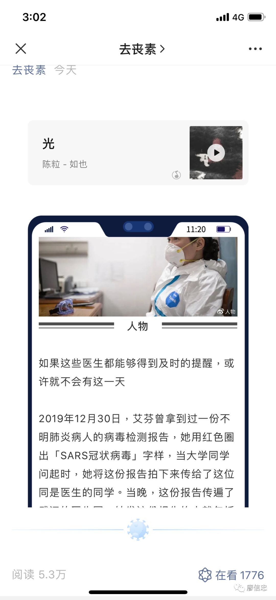
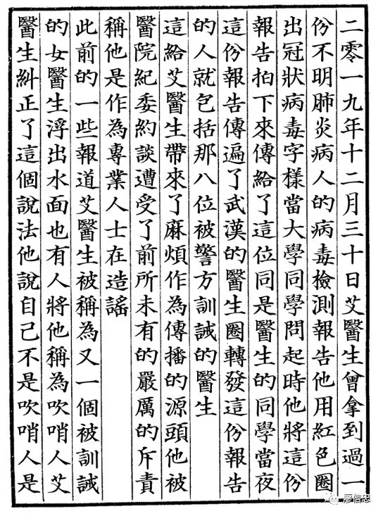

## 今天是微信公号诞生以来最荒谬的一天

转载 廖信忠 *今天*

大家都知道昨天有篇文章被删了

本来，它只是每年不计其数被删文章的其中一篇

按以往经验，很自然会想到图片、PDF、竖排的方式传播

豎排

滑动图片

反着排版也是常見反机查的方式

你以为改标题就抓不到你了吗！！

比如空白一片，复制黏贴到记事本上后才能阅读

改成汉语拼音的版本，小朋友都能读

改成竖版书印刷体的方式排版

结果，以上方式也纷纷失效

于是，有人开始翻译成各种语文版本传播

改成竖版书印刷体的方式排版

结果，以上方式也纷纷失效

于是，有人开始翻译成各种语文版本传播

**英文**

**日文**

**德文**

**粤语**

我至少已看到十种不同语文的版本了；外语版也纷纷阵亡后，开始出现一些奇怪的语言及符号

**非主流火星文版**(看不懂表示你老了)

**emoji版**

**精灵语和克林贡语**

这几个版本竟然又阵亡了。

我不知道，公号里那些在做审核的小哥哥小姐姐们，今天是不是在边笑边删

于是，又一波人创作了新的版本，比如盲文

有人将全文谱成一首曲子!

[img](ar_08.assets/640-1583937131636.jpeg)

摩斯电码的版本也有，像我这种外行人，只看一堆颜文字

传统文化爱好者也坐不住了，开始制作一批奇怪的版本。这时候，这篇文章传播的意义已经变质了，成为一场行为艺术。

比如，古籍线装书版本

**甲古文版本**

**篆文版本**

**天書版本**

**气势磅秤的毛体版本**

但我不知道为什么这些已经做成图片的变体版本都能被被删，除非是有人看完觉得哈哈哈好好好笑，然后顺手按下了举报

但我不知道为什么这些已经做成图片的变体版本都能被被删，除非是有人看完觉得哈哈哈好好好笑，然后顺手按下了举报

接着，连十六进制版本都出现了

**编码版本**，需用Base64进行译码阅读

**条型码版本**

**二维码版本**

还有好多版本在传播，我就不一一列出了；索绪尔老师如果看到这一幕，不知他会不会受到震撼而改写他的理论

好玩吗？当然好玩

这是由一篇文章引发的荒谬喜剧；但也完美诠释了，**喜剧的内核，就是一场悲剧**

**作为一位写作的人希望下一代能够自由毫无挂虑地使用汉语**
